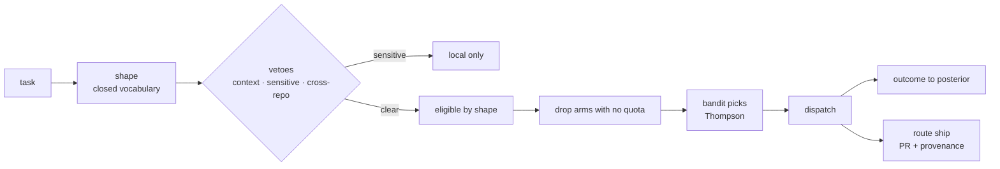

# route-skill

**Your weekly Claude quota expires unused while Codex sits idle and a 128 GB Mac
does nothing.** You know some tasks belong on a cheaper pool. Deciding *which* —
every time, against live quota, without sending a 4,000-item batch job to an
agent that only accepts files — is a judgement call you make badly when you're
busy, and never record.

`route-skill` makes the decision explicitly, dispatches it, and gets better at
it. Shape rules out pools that structurally cannot do the work, quota rules out
pools with no headroom, and a Thompson-sampled bandit picks among the rest —
learning per task-shape which pool actually delivers.

```text
$ route "classify 4000 commit messages into categories"
{
  "shape": "batch:classify",  "tier": "trivial",
  "chosen": "local-batch",    "eligible": ["claude", "local-batch"],
  "why": "posterior"
}
```

## Sensitive work runs on hardware you own

Mention credentials, customer data or a `.env` and the remote pools are removed
outright — and it prefers your **local** machine over Claude, because that is
the only arm where the data never leaves at all:

```text
$ route "audit the customer database credentials"
{
  "chosen": "local-batch",
  "data_class": "sensitive",
  "removed_by_sensitivity": ["codex", "kimi", "free"],
  "why": "posterior+sensitive:local-preferred(auto-detected)"
}
```

That is a **veto, not a score** — it holds even when every other arm is idle. If
nothing eligible remains, it fails loudly rather than quietly falling back to a
remote pool, which is the exact failure the flag exists to prevent.

Detection is explicit by design (`--sensitive`, a task field, or a path
allowlist in `sensitive.toml`). The content match above is a **one-way safety
net**: a hit escalates caution, a miss proves nothing. Do not rely on it —
a heuristic that misses silently ships private data to a third party.

## Five arms, four cost classes

| arm | cost class | for |
|---|---|---|
| `claude` | `included` | anything needing this conversation's context |
| `codex`, `kimi` | `paid` | hard self-contained coding, separate quota pools |
| `local-batch`, `local-agent` | `local` | volume + anything sensitive — memory-bound, free |
| `free` | `free` | delay-tolerant batch via [`free-llm`](https://github.com/jhammant/free-llm-skill) — eleven pooled free tiers |



There is deliberately **no "switch to adaptive" flag**. Each arm's Beta prior
*is* the hand-written rule table, so a cold cell behaves exactly like the rules
and evidence takes over on its own, per cell, as it accumulates.

## The decision, in order

Routing is not a single score. It is a filter chain, then a bandit.

```
task text
   │
   ├─▶ 1. SHAPE      closed vocabulary — what kind of work is this?
   ├─▶ 2. VETO       hard gates: must this stay here?            → claude, done
   ├─▶ 3. ELIGIBLE   which arms can do this shape at all?
   ├─▶ 4. QUOTA      drop arms with no headroom (quotamax)
   ├─▶ 5. SELECT     bandit picks among survivors (banditry)
   ├─▶ 6. DISPATCH   hand to /codex, /kimi, /local-llm, /free-llm, or stay
   └─▶ 7. OUTCOME    record reward, update posterior, maybe escalate
```

1. **Shape** — `shapes.py` classifies into a fixed enum
   (`coding:implement|refactor|test|debug|review`, `batch:classify|summarize|extract|embed`,
   `research`, `writing`, `orchestration`). Privacy-critical: the shape is the
   federation key, so it can never be free text. Unknown maps to `orchestration`,
   which never routes away.
2. **Veto** — hard gates, not scores. Needs this conversation's context, cross-repo
   orchestration, private data, no clear acceptance check, or an explicit `--pool`
   pin: any of these short-circuits to `claude` regardless of quota or complexity.
   The private-data gate is a *safety net* only (see **Sensitive data** below):
   several hosted free tiers (Gemini, Mistral) train on submitted prompts, so a
   task carrying private data can **never** land on the `free` arm.
3. **Eligibility** — `pools.py` is a config-driven arm registry
   (`~/.config/route/pools.toml`); a new model is a config entry, not a code change.
   A `batch:*` shape never yields `codex`/`kimi`; a `coding:*` shape never yields
   `local-batch`. Arms with a health endpoint (`free`) are eligible only while it
   answers — an unreachable proxy removes the arm, never an error.
4. **Quota** — `quotamax agent --json`. An arm at `critical` headroom is **removed**,
   not penalised. Quota gates availability; the bandit decides quality.
5. **Select** — `router.py` wraps [banditry](https://github.com/jhammant/banditry):
   one Thompson-sampling bandit per `route:{shape}:{tier}` cell, Beta priors seeded
   from the static rule table (`data/priors.toml`): favoured pools start at
   `Beta(8,2)`, the rest at `Beta(2,8)`. Cold start behaves exactly like the rules;
   evidence swamps the prior automatically, per cell. **There is no "switch to
   adaptive" flag — that is the entire reason to use a bandit.**
6. **Dispatch** — hands to the existing skills or returns `stay` for Claude. Never
   reimplements them, never triggers paid provisioning.
7. **Outcome** — reward events ranked by the signal hardest to fake: `accepted`
   (diff kept) > `verified` (tests passed) > `completed` (ran). Escalation is capped
   at one hop to the next-stronger eligible arm, and records a *negative* outcome
   for the arm it leaves behind.

## The arms and their cost classes

Each arm declares a **cost class**, which is what the bandit is really trading
off against quality:

- `included` — **claude**: subscription quota you have already paid for.
- `paid` — **codex**, **kimi**: metered API spend.
- `local` — **local-batch**, **local-agent**: memory-bound models on your own
  hardware via `local-llm`. With an optional `endpoint` in `pools.toml`, the
  same tool can back several arms (`local-batch-lmstudio` vs
  `local-batch-ollama` — dispatch gets `--endpoint <url>` appended) and the
  bandit learns which backend is better per task shape.
- `free` — **free**: £0/month, but rate-limited and **remote**. Dispatches
  through the [free-llm](https://github.com/jhammant/free-llm-skill) proxy on
  `127.0.0.1:8080`, which pools hosted free tiers (Groq, NVIDIA NIM, OpenRouter,
  Cloudflare, GitHub Models, Gemini, Z.AI, ModelScope, SambaNova, OVH, Mistral)
  without ever exceeding a provider's published rate limit. It takes `batch:*`
  work plus the simplest coding shapes (`coding:test`, `coding:review`) — never
  `coding:refactor`, `coding:debug`, or orchestration, because free-tier models
  are materially weaker. Eligible only while the proxy answers on `/healthz`;
  an unreachable proxy just removes the arm. Because the providers are third
  parties and several train on prompts, **sensitive data never routes to
  `free`** — for a `sensitive` task the arm is vetoed at the eligibility
  stage, hardest of all the remote vetoes.

## Sensitive data — prefer local, never fall back remote

Every task carries a `dataClass`: `open` (default) or `sensitive`. When a task
is sensitive, the remote third-party pools — `codex`, `kimi`, `free` — are
removed at the **eligibility** stage (a veto, not a score). `claude` stays
eligible, and so do `local-batch` / `local-agent` — the only arms where the
data is safe *by construction*, because it physically never leaves the
machine. Among the survivors, local arms are **preferred** over `claude`:
sensitive work is exactly what an idle local machine is for — free, private,
and already paid for. If sensitivity leaves **no** eligible arm, routing fails
loudly with the reason; it never silently falls back to a remote arm, because
that fallback is the exact failure the flag exists to prevent.

Sensitivity is detected from **explicit signals only**:

1. `--sensitive` on the command line.
2. A `sensitive: true` field on a task passed programmatically.
3. A path allowlist in `~/.config/route/sensitive.toml`:

   ```toml
   paths = ["~/dev/clients/*", "~/Documents/finance/*"]
   ```

   A task naming a file under one of those paths is sensitive.

The old content-matching regex (`--private`, matching "secrets", ".env",
"credentials", …) still fires as an **additional safety net** — it
conservatively pins the task to `claude`. But it must never be the only
signal you rely on: a false negative silently sends private data to a third
party, and no regex is worth that risk. When unsure, mark it yourself.

```text
$ route --sensitive "rotate the API credentials in the production .env file"
  shape     coding:implement      eligible  claude, local-agent
  tier      moderate              chosen    local-agent
  why       prior+sensitive:local-preferred   (codex, kimi vetoed: sensitive)
```

## Install

```sh
pip install "route-skill @ git+https://github.com/jhammant/route-skill"
```

Optional integrations, all fail-open: `quotamax` (quota), `taskgauge` via `node`
(complexity), `local-llm` (shape tiebreak). Without them, built-in fallbacks keep
the tool standalone.

## Usage

```sh
route refactor the router into smaller functions   # decide + explain + confirm
auto classify these 2,000 support tickets          # decide + dispatch now

route stats                    # per-cell: obs, success rate, prior vs posterior
route stats --arm codex        # one pool, by shape
route stats --throughput       # local model performance table

route outcome --shape coding:refactor --tier hard --arm codex --outcome accepted

route federate export          # what WOULD be shared — prints it, shares nothing
route federate push --yes      # opt-in contribute (writes a submission file)
route federate pull --source community.json
route federate status          # what's shared, when, what's held back

route ship                     # show the diff, confirm, push the task branch
route ship --pr                # …and open a PR carrying the routing provenance
route ship --pr --repo owner/awesome-list --base main   # upstream: forks first
```

## `route ship` — from routed task to reviewable PR

A routed coding task ends as edits on a branch, and then stops. `ship` closes
the loop: it shows you `git status` + `git diff --stat` (the full diff with
`--diff`, never redacted), asks for explicit confirmation, pushes the branch,
and opens a PR whose body carries the routing provenance:

```markdown
Routed by /route.

| | |
|---|---|
| shape | coding:implement |
| complexity | moderate |
| arm | kimi |
| why | claude weekly at 88%; task self-contained with a clear acceptance check |
| verification | 62 tests pass |
```

That table records *why this model wrote this code* — provenance that is
otherwise lost the moment the session ends.

Hard safety rules:

- **Never pushes or opens a PR without explicit confirmation on that
  invocation.** Pushing is outward-facing and effectively irreversible.
- **Never merges** — `ship` opens PRs; a human merges them.
- **Never force-pushes**, and never pushes the default branch.
- A tree dirty outside the task's branch aborts the ship rather than sweeping
  unrelated changes in.
- If `gh` is absent, it pushes and prints the compare URL instead of failing.
- Targeting a repo without push access (`--repo owner/theirs`) forks first via
  `gh repo fork`, pushes to the fork, and opens the PR from there — the
  standard listing-submission flow. The confirmation prompt names the target
  repo, because opening a PR on someone else's project is a public act.

## Federation — counts, not content

The unit of sharing is the Beta posterior, because Beta is conjugate to Bernoulli
and composes by addition: merging N users is `α=Σαᵢ, β=Σβᵢ`. What leaves the
machine (opt-in, off by default) is exactly:

```json
{"schema":1, "context":"coding:refactor:hard", "arm":"codex",
 "model":"gpt-5.6-sol", "alpha":14, "beta":3}
```

**Never** leaves: prompts, diffs, file paths, repo names, task titles, item
content — enforced at assert level by `assert_payload_clean` (record keys are
fixed; contexts must be closed-enum cells; arm/model identifiers cannot contain
whitespace or path separators). `route federate export` exists so you can see
exactly what would leave before anything does.

Anti-gaming: per-installation contribution is capped (200 counts/record),
k-anonymity suppresses cells with fewer than 3 contributors, model identity is
pinned to `model+quant+version`, and the aggregate is a static JSON file in a
public repo, rebuilt nightly by CI — auditable and forkable, with no central
database of user behaviour. Community counts are discounted **0.4×** and team
counts **0.7×** before becoming your prior; your own observations update on top
and eventually dominate.

## Development

```sh
python -m venv .venv && .venv/bin/pip install -e ".[dev]"
.venv/bin/python -m pytest
```

Tests are deterministic: no network, no real dispatch, no money spent.

## License

MIT

## Use from Codex

The router supports both host agents. Pass `--host codex` or set
`ROUTE_HOST=codex` inside Codex. Existing Claude installations keep the default
`claude` host. Context-dependent work and exhausted-pool fallbacks stay with
the current host; provider names and learned statistics remain unchanged.

From a checkout installed into `.venv`:

```bash
./.venv/bin/route --host codex --pool claude "Write tests for src/parser.py"
./.venv/bin/auto --host codex --pool claude "Write tests for src/parser.py"
./.venv/bin/route --host codex --plan-only "Review the parser changes"
mkdir -p "$HOME/.agents/skills"
ln -s "$PWD/skill" "$HOME/.agents/skills/route"
ln -s "$PWD/skill-auto" "$HOME/.agents/skills/auto"
```

Restart Codex and invoke `$route` or `$auto`. Keep the checkout in place and
move aside existing skill directories before linking. On macOS, bare `route`
may be `/sbin/route`, the network utility; use the installed package executable.

`route` asks before dispatch; `auto` dispatches immediately. `--plan-only`
does neither, but still records its routing decision. Claude delegation runs
`claude --print --permission-mode auto` in the current directory and inherits
Claude's configured model and authentication. No permission bypass is added.
Give the delegate a self-contained task and verify its diff and tests afterward.
Task text is passed as one argument without shell evaluation; child agents
receive their own `ROUTE_HOST`.

Quota reads now combine Claude agent advice and Codex/Kimi provider limits.
Nonzero critical-quota exit codes retain their warning; expired windows are
ignored. Provider usage at 95% is considered critical. Sensitive routing keeps
the current host and local pools eligible, excluding other remote providers
unless the user explicitly pins a pool (the existing pin policy).
