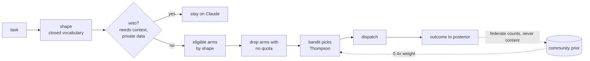

# route-skill

**Your weekly Claude quota expires unused while Codex sits idle and a 128 GB Mac
does nothing.** You know some tasks belong on a cheaper pool, but deciding
*which* — every time, against live quota, without sending a 4,000-item batch job
to an agent that only takes files — is a judgement call you make badly when
you're busy, and never record.

`route-skill` makes that decision explicitly, dispatches it, and gets better at
it. Task shape rules out pools that structurally cannot do the work, quota rules
out pools with no headroom, and a Thompson-sampled bandit picks among what's
left — learning per task-shape which pool actually delivers.

```text
$ route "classify 4000 commit messages into categories"
  shape     batch:classify        eligible  claude, local-batch
  tier      trivial               chosen    local-batch
  why       codex and kimi cannot take a batch shape; local has headroom
```



There is deliberately **no "switch to adaptive" flag**. Each arm's Beta prior *is*
the hand-written rule table, so a cold cell behaves exactly like the rules and
evidence takes over on its own, per cell, as it accumulates.

## The decision, in order

Routing is not a single score. It is a filter chain, then a bandit.

```
task text
   │
   ├─▶ 1. SHAPE      closed vocabulary — what kind of work is this?
   ├─▶ 2. VETO       hard gates: must this stay here?            → claude, done
   ├─▶ 3. ELIGIBLE   which arms can do this shape at all?
   ├─▶ 4. QUOTA      drop arms with no headroom (quotamax)
   ├─▶ 5. SELECT     bandit picks among survivors (banditry)
   ├─▶ 6. DISPATCH   hand to /codex, /kimi, /local-llm, or stay
   └─▶ 7. OUTCOME    record reward, update posterior, maybe escalate
```

1. **Shape** — `shapes.py` classifies into a fixed enum
   (`coding:implement|refactor|test|debug|review`, `batch:classify|summarize|extract|embed`,
   `research`, `writing`, `orchestration`). Privacy-critical: the shape is the
   federation key, so it can never be free text. Unknown maps to `orchestration`,
   which never routes away.
2. **Veto** — hard gates, not scores. Needs this conversation's context, cross-repo
   orchestration, private data, no clear acceptance check, or an explicit `--pool`
   pin: any of these short-circuits to `claude` regardless of quota or complexity.
3. **Eligibility** — `pools.py` is a config-driven arm registry
   (`~/.config/route/pools.toml`); a new model is a config entry, not a code change.
   A `batch:*` shape never yields `codex`/`kimi`; a `coding:*` shape never yields
   `local-batch`.
4. **Quota** — `quotamax agent --json`. An arm at `critical` headroom is **removed**,
   not penalised. Quota gates availability; the bandit decides quality.
5. **Select** — `router.py` wraps [banditry](https://github.com/jhammant/banditry):
   one Thompson-sampling bandit per `route:{shape}:{tier}` cell, Beta priors seeded
   from the static rule table (`data/priors.toml`): favoured pools start at
   `Beta(8,2)`, the rest at `Beta(2,8)`. Cold start behaves exactly like the rules;
   evidence swamps the prior automatically, per cell. **There is no "switch to
   adaptive" flag — that is the entire reason to use a bandit.**
6. **Dispatch** — hands to the existing skills or returns `stay` for Claude. Never
   reimplements them, never triggers paid provisioning.
7. **Outcome** — reward events ranked by the signal hardest to fake: `accepted`
   (diff kept) > `verified` (tests passed) > `completed` (ran). Escalation is capped
   at one hop to the next-stronger eligible arm, and records a *negative* outcome
   for the arm it leaves behind.

## Install

```sh
pip install "route-skill @ git+https://github.com/jhammant/route-skill"
```

Optional integrations, all fail-open: `quotamax` (quota), `taskgauge` via `node`
(complexity), `local-llm` (shape tiebreak). Without them, built-in fallbacks keep
the tool standalone.

## Usage

```sh
route refactor the router into smaller functions   # decide + explain + confirm
auto classify these 2,000 support tickets          # decide + dispatch now

route stats                    # per-cell: obs, success rate, prior vs posterior
route stats --arm codex        # one pool, by shape
route stats --throughput       # local model performance table

route outcome --shape coding:refactor --tier hard --arm codex --outcome accepted

route federate export          # what WOULD be shared — prints it, shares nothing
route federate push --yes      # opt-in contribute (writes a submission file)
route federate pull --source community.json
route federate status          # what's shared, when, what's held back
```

## Federation — counts, not content

The unit of sharing is the Beta posterior, because Beta is conjugate to Bernoulli
and composes by addition: merging N users is `α=Σαᵢ, β=Σβᵢ`. What leaves the
machine (opt-in, off by default) is exactly:

```json
{"schema":1, "context":"coding:refactor:hard", "arm":"codex",
 "model":"gpt-5.6-sol", "alpha":14, "beta":3}
```

**Never** leaves: prompts, diffs, file paths, repo names, task titles, item
content — enforced at assert level by `assert_payload_clean` (record keys are
fixed; contexts must be closed-enum cells; arm/model identifiers cannot contain
whitespace or path separators). `route federate export` exists so you can see
exactly what would leave before anything does.

Anti-gaming: per-installation contribution is capped (200 counts/record),
k-anonymity suppresses cells with fewer than 3 contributors, model identity is
pinned to `model+quant+version`, and the aggregate is a static JSON file in a
public repo, rebuilt nightly by CI — auditable and forkable, with no central
database of user behaviour. Community counts are discounted **0.4×** and team
counts **0.7×** before becoming your prior; your own observations update on top
and eventually dominate.

## Development

```sh
python -m venv .venv && .venv/bin/pip install -e ".[dev]"
.venv/bin/python -m pytest
```

Tests are deterministic: no network, no real dispatch, no money spent.

## License

MIT
