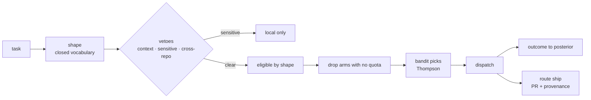

# route-skill

**Your weekly Claude quota expires unused while Codex sits idle and a 128 GB Mac
does nothing.** You know some tasks belong on a cheaper pool. Deciding *which* —
every time, against live quota, without sending a 4,000-item batch job to an
agent that only accepts files — is a judgement call you make badly when you're
busy, and never record.

`route-skill` makes the decision explicitly, dispatches it, and gets better at
it. Shape rules out pools that structurally cannot do the work, quota rules out
pools with no headroom, and a Thompson-sampled bandit picks among the rest —
learning per task-shape which pool actually delivers.

```text
$ route "classify 4000 commit messages into categories"
{
  "shape": "batch:classify",  "tier": "trivial",
  "chosen": "local-batch",    "eligible": ["claude", "local-batch"],
  "why": "posterior"
}
```

## Sensitive work runs on hardware you own

Mention credentials, customer data or a `.env` and the remote pools are removed
outright — and it prefers your **local** machine over Claude, because that is
the only arm where the data never leaves at all:

```text
$ route "audit the customer database credentials"
{
  "chosen": "local-batch",
  "data_class": "sensitive",
  "removed_by_sensitivity": ["codex", "kimi", "free", "deepseek"],
  "why": "posterior+sensitive:local-preferred(auto-detected)"
}
```

That is a **veto, not a score** — it holds even when every other arm is idle. If
nothing eligible remains, it fails loudly rather than quietly falling back to a
remote pool, which is the exact failure the flag exists to prevent.

Detection is explicit by design (`--sensitive`, a task field, or a path
allowlist in `sensitive.toml`). The content match above is a **one-way safety
net**: a hit escalates caution, a miss proves nothing. Do not rely on it —
a heuristic that misses silently ships private data to a third party.

When it misfires the other way (public work that mentions "customer data" to say there
is none), `--open` declares the data public. It overrides only the content match, never
an explicit signal (`--sensitive`, `--private`, a `sensitive.toml` path, which all make
`--open` fail loudly), and the plan records `data_class_override` so it stays auditable.

## Six arms, four cost classes

| arm | cost class | for |
|---|---|---|
| `claude` | `included` | anything needing this conversation's context |
| `codex`, `kimi` | `included` | hard self-contained coding, separate subscription quota pools — `codex` runs GPT-6 Astra and owns long-horizon work |
| `deepseek` | `paid` | pay-as-you-go backstop when no included, free or local arm survives |
| `local-batch`, `local-agent` | `local` | volume + anything sensitive — memory-bound, free |
| `free` | `free` | delay-tolerant batch via [`free-llm`](https://github.com/jhammant/free-llm-skill) — eleven pooled free tiers |


```mermaid
flowchart LR
  A[task] --> B[shape<br/>closed vocabulary]
  B --> C{vetoes<br/>context · sensitive · cross-repo}
  C -->|sensitive| L[local only]
  C -->|clear| D[eligible by shape]
  D --> E[drop arms with no quota]
  E --> F[bandit picks<br/>Thompson]
  F --> G[dispatch]
  G --> H[outcome to posterior]
  G --> S[route ship<br/>PR + provenance]
```

There is deliberately **no "switch to adaptive" flag**. Each arm's Beta prior
*is* the hand-written rule table, so a cold cell behaves exactly like the rules
and evidence takes over on its own, per cell, as it accumulates.

## Long-running work goes to Codex on GPT-6 Astra

Duration is a different axis from difficulty. "Fix every failing test in the
suite" is individually easy and takes hours. A long-horizon cue (`until all
tests pass`, `every call site`, `whole codebase`, `overnight`) floors the tier
at `hard`, and the `hard` / `open-ended` coding cells favour `codex` alone:
GPT-6 Astra leads on Terminal-Bench 4.0 and keeps searchable notes across
context windows, so it stays coherent where a rolling summary drifts. Rules
are keyed by `shape` or `shape:tier` in `priors.toml`, so this is one config
line per cell, not a new arm. On single-shot coding Astra ties or trails
Fable, so the shape-level rules are unchanged.

```text
$ route --plan-only "keep going until every test in the whole repo passes"
{
  "shape": "coding:test",    "tier": "hard",   "horizon": "long",
  "chosen": "codex",         "why": "prior+long-horizon",
  "quota": "live"
}
```

The `codex` arm's model identity is read from `$CODEX_HOME/config.toml`
rather than assumed, because counts learned under `gpt-5.6-sol` are not
evidence about `gpt-6-astra` and must never merge.

Cells are seeded once, so a rule change never reaches a cell you have already
used. `route reseed` moves every live cell's seed to the current table as a
delta on the counts, leaving real observations exactly as they were;
`--dry-run` shows the moves first.

## The decision, in order

Routing is not a single score. It is a filter chain, then a bandit.

```text
task text
   │
   ├─▶ 1. SHAPE      closed vocabulary — what kind of work is this?
   ├─▶ 2. VETO       hard gates: must this stay here?            → host, done
   ├─▶ 3. ELIGIBLE   which arms can do this shape at all?
   ├─▶ 4. QUOTA      drop arms with no headroom (quotamax)
   ├─▶ 5. SELECT     bandit picks among survivors (banditry)
   ├─▶ 6. DISPATCH   hand to /codex, /kimi, /deepseek, /local-llm, /free-llm, or stay
   └─▶ 7. OUTCOME    record reward, update posterior, maybe escalate
```

1. **Shape** — `shapes.py` classifies into a fixed enum
   (`coding:implement|refactor|test|debug|review`, `batch:classify|summarize|extract|embed`,
   `research`, `writing`, `orchestration`). Privacy-critical: the shape is the
   federation key, so it can never be free text. Unknown maps to `orchestration`,
   which never routes away.
2. **Veto** — hard gates, not scores. Needs this conversation's context, cross-repo
   orchestration, private data, no clear acceptance check, or an explicit `--pool`
   pin: these short-circuit to the current host (default `claude`), or to the
   explicitly pinned pool, regardless of quota or complexity.
   The private-data gate is a *safety net* only (see **Sensitive data** below):
   several hosted free tiers (Gemini, Mistral) train on submitted prompts, so a
   task carrying private data can **never** land on the `free` arm.
3. **Eligibility** — `pools.py` is a config-driven arm registry
   (`~/.config/route/pools.toml`); a new model is a config entry, not a code change.
   Delegated `codex`/`kimi` arms do not accept `batch:*`; the current host can
   handle any shape. A `coding:*` shape never yields `local-batch`.
   Arms with a health endpoint (`free`) are eligible only while it
   answers — an unreachable proxy removes the arm, never an error.
4. **Quota** — `quotamax agent --json`. An arm at `critical` headroom is **removed**,
   not penalised. Quota gates availability; the bandit decides quality. For the
   `deepseek` backstop, "quota" is the credit balance: `backstop.low` or
   `available: false` removes it, falling back to the skill's `balance --json`
   when quotamax has no backstop field; `--no-quota` skips the check.
5. **Select** — `router.py` wraps [banditry](https://github.com/jhammant/banditry):
   one Thompson-sampling bandit per `route:{shape}:{tier}` cell, Beta priors seeded
   from the static rule table (`data/priors.toml`): favoured pools start at
   `Beta(8,2)`, the rest at `Beta(2,8)`. Cold start behaves exactly like the rules;
   evidence swamps the prior automatically, per cell. **There is no "switch to
   adaptive" flag — that is the entire reason to use a bandit.**
6. **Dispatch** — uses each arm's configured command or returns `stay` for the
   current host. Codex can delegate to Claude as described below. Dispatch
   never triggers paid provisioning.
7. **Outcome** — reward events ranked by the signal hardest to fake: `accepted`
   (diff kept) > `verified` (tests passed) > `completed` (ran). The dispatch exit
   code records `completed` or `failed` by itself; `route outcome` adds what only
   the caller knows, skipping events already on the decision. A `--pool` pin is
   counted as a trial, so pinned runs are evidence too. Escalation is capped
   at one hop to the next-stronger eligible arm, and records a *negative* outcome
   for the arm it leaves behind. Each dispatch is also costed: quotamax usage
   is snapshotted either side of it and the delta stored on the decision, so
   `route stats --quota` shows, per arm, quota spent per dispatch and per
   accepted result next to the accept rate.

## Graded feedback — count the rescue work

Every plan prints a stable `decision_id`. Pass it back after checking the work:

```bash
route outcome --decision <id> --score 0.7
route outcome --decision <id> --fix-passes 1
route outcome --decision <id> --abandoned   # also --rewritten
```

A score must be finite and between 0 and 1. It contributes exactly one Beta
trial: `alpha += score`, `beta += 1 - score`. Fix passes map to 0 → 1.0,
1 → 0.7, 2 → 0.4, 3 → 0.1, and 4 or more → 0.0. Abandonment or a rewrite
by the supervising agent earns 0.0 regardless of passes.

Grading replaces that decision's previous reward. It reuses the dispatch's
trial, supersedes plain `completed`, and repeated identical settlement does
nothing to the counts. A corrected score applies only the difference. Explicit
grades remain authoritative if a legacy `accepted` event arrives later.
`--outcome accepted|verified|completed|failed` still records the same cumulative
events, skipping events already recorded for the decision. Without an ID,
`--shape`, `--tier`, and `--arm` address the latest matching decision; with no
matching decision a manual grade creates a new trial each time.

## `route settle` — one line for dispatch callers

```bash
route --host codex --plan-only "build the parser endpoint"
# Keep decision_id from the plan; execute and verify the work, then:
route settle --decision <id> --fix-passes 1 --merged
route settle --decision <id> --abandoned
```

`--merged` marks the diff accepted without replacing its quality score with 1.
`--merged` and `--abandoned` are mutually exclusive. Use the ID when several
tasks are in flight: settlement attaches to that decision even after later
plans or dispatches. Plans, declined dispatches, and `stay` decisions are pending;
they contribute a trial only when dispatched or settled. This also lets a skill
plan here, dispatch elsewhere, and report the result in one command. Existing
historical counts are left intact.

## Balance surplus quota and pressure

Among eligible arms, the router adds a bonus to each Thompson draw based on the
quota projected to remain unused at the end of its seven-day window, provided
reset is at least two days away:

```text
elapsed = 1 - resetsInMinutes / 10080
used = percentUsed / 100
projected_end = used / elapsed
surplus = clamp(1 - projected_end, 0, 1)
overuse = clamp(projected_end - 1, 0, 1)
if less than one day has elapsed:
    surplus = max(max(0, elapsed - used), 0.5 * surplus)
    overuse = max(max(0, used - elapsed), 0.5 * overuse)
if headroom == "constrained":
    overuse = max(overuse, 0.5)
adjustment = -k * overuse if overuse > 0 else k * surplus
```

The first-day rule damps a noisy early projection; a just-reset window with no
elapsed time earns zero. For example, 7% used with 6.2 days remaining projects
61.25% used at reset, leaving 38.75% unused. After first-day damping, the default
bonus is **0.0290625**, rather than roughly 0.0066 from the old pace delta.
Conversely, 28% used after 0.7 days projects 280% usage at reset. Its capped,
damped overuse earns **−0.075** pressure. `constrained` headroom also imposes at
least `0.5 * k` pressure, even with missing weekly data or spare weekly quota:
a session limit can be binding. Pressure takes precedence over a surplus bonus.

`k` defaults to 0.15 and is capped at 0.15. Set it to 0 to disable, or lower it
in `~/.config/route/config.toml` (`ROUTE_CONFIG_DIR` overrides this directory):

```toml
[surplus]
k = 0.10
```

Both adjustments use the same quotamax snapshots as quota gating. Missing,
invalid or expired windows give no projection; constrained headroom still
supplies its minimum pressure. Surplus needs at least two days remaining;
pressure applies until reset. `--no-quota` disables both. Vetoes, critical
quota gates, the paid backstop rule and sensitive-local preference apply first.
Pressure never removes an arm. Plans expose signed `quota_adjustment` values
and append `+surplus:<arm>` or `-pressure:<arm>` to `why` for the chosen arm.
`surplus_bonus` remains a **deprecated alias with the same signed values** for
one release. Adjustments affect selection only, never learned counts.

## Two Claude Code accounts

If you have a second Claude subscription (a work seat, say), its quota can run
headless workers while your own session stays on your account. Four pieces fit
together:

- [claude-work](https://github.com/jhammant/claude-work) runs Claude Code on the
  second account for one process, without touching your main login.
- [quotamax](https://github.com/jhammant/quotamax) shows both accounts' usage,
  including per-model windows such as Fable's.
- route (this repo) sends each task to whichever account or model has quota.
- [/ultra](#ultra-your-own-ultracode) plans a job into checked units and runs
  them across both accounts and Codex on the best models.

Install [claude-work](https://github.com/jhammant/claude-work) first, then:

```bash
claude-work login      # mint a setup-token for that account; stored in the Keychain
claude-work status     # fresh quota reading for it, next to your main account's
route "write the tests for src/parse.py" --pool claude-work-sonnet
route "fix the flaky retry" --context digest     # the worker gets this conversation, minus tool output
```

`claude-work` passes the token to `claude` through `CLAUDE_CODE_OAUTH_TOKEN`
for that process only, so the main login never changes. It shares `~/.claude`,
which is what lets a worker fork a session.

A setup-token has the `user:inference` scope only, which the usage endpoint
refuses. quotamax instead reads the account from the `rate_limit_event` that a
~500-token Haiku probe reports (detached, at most every ten minutes). The
account is the `claude-work` pool; its Fable week is the separate key
`claude-work:Fable`, so a spent Fable week removes `claude-work-fable` and
leaves the other arms. `examples/claude-work-pools.toml` defines three arms
(Opus, Fable, Sonnet) with `quota_provider`, `quota_scope`, `prior_like` and
`claude_cli`. Workers start with no MCP servers; swarm members still get
their a-mail server.

### Handoff context: brief, digest, fork

Across twelve large real sessions, tool output was 91.7% of the transcript and
what was actually said was 2.4%. So `--context digest` hands a delegate the
conversation and one line per tool call, and drops the output: the worker
knows what was decided and re-reads current files itself. `--context fork`
resumes the whole session, for Claude Code arms only; it is cheap only on the
same account and model, because the prompt cache is scoped to both.

## /ultra: your own ultracode

Give it a goal and a check for the whole goal; it does the rest without asking.

```bash
route ultra "Add rate limiting to src/api/, stdlib only. Goal check: pytest -q tests/api" --json
```

1. A top model plans the goal into independent units, each with its own check.
2. The units run as a swarm (below) on the best models in whichever pools have
   quota: Fable, Opus, the second Claude account, Codex, and your own account
   when it has headroom. Sonnet and Kimi join only with `--allow-lower-models`,
   and only when nothing better has quota.
3. A model from a different family reviews each non-trivial accepted unit. A
   finding counts only when its repro command shows the bug, and each unit
   gets at most two fix passes. Up to `--max-parallel` units (default 6) move
   through review and fixes concurrently; a unit can start fixing as soon as
   its own review finishes. Failed build checks go straight to fixing in the
   same pool of jobs. Agent dispatches also respect each arm's `parallel_limit`.
4. Accepted branches merge onto `ultra/<run-id>` (build artefacts are never
   staged; a real conflict gets the integrator one pass) and the goal check
   runs there. Merges follow plan order regardless of when reviews finish.
5. Outcomes are settled for the router, and `summary.md` names the branch, the
   units that passed, the bugs the reviews confirmed, the quota spent per pool
   and the merge command.

It never merges into your base branch or main, and never pushes. Checks run
without a shell, and only test runners are allowed in them. `--plan-only`
shows the plan, `--context digest` hands the workers this conversation, and
`route ultra status` and `route ultra cancel <run-id>` watch and stop a run.
Each run's state lives in `ROUTE_STATE_DIR/ultra/<run-id>/`. Exit 0 means every
unit merged and the goal check passed, 1 that a unit was not merged or the goal
check failed, and 2 that it could not plan or no usable model had quota. `ultra` is the same command. Pin planning and building to chosen pools with `--pool ARM`
(repeatable, e.g. `--pool claude-work`); reviews still go to another model family. For
`/ultra` in Claude Code, link the skill:
`ln -s "$PWD/skill-ultra" "$HOME/.claude/skills/ultra"`.

### Research mode

`--research` points ultra at a question instead of a goal. Nothing is built or
merged; you get a report with citations.

```bash
route ultra --research "Compare Postgres hosting for an EU B2B app: PITR, RLS, residency, price at 200 GB" --json
```

1. A top model plans the question into independent sub-questions.
2. Background agents on the best models with quota answer each one read-only,
   with web search and fetch, a shell, the MCP servers allowlisted in
   `research.toml`, and read access to `--repo` when you pass one.
3. A synthesizer merges the answers into one report and cites each claim
   (`[part-id:S1]`), resolved in its `## Sources` list.

`ultra --research "<question>"` is the same command. Flags:

- `--repo PATH`: the repo the question is about; agents can read it.
- `--context brief|digest` and `--session ID`: as for build runs.
- `--max-parts N` (default 6) caps the sub-questions; `--max-parallel N`
  (default 6) caps how many run at once.
- `--plan-only` shows the split and stops.
- `--allow-lower-models` lets lower-ranked Claude arms such as Sonnet in when
  nothing better has quota. Research only drives `claude`, `claude-work` and
  `codex`, so a Kimi arm is skipped even with this flag.
- `--json` prints the result as JSON.

`--base` and `--max-units` are ignored with `--research`.

**Read-only.** Claude arms run in `--repo` with
`--disallowedTools Edit Write NotebookEdit` and a strict MCP config that holds
only the allowlisted servers, so they are read-only by instruction. Codex arms
run `codex exec --sandbox workspace-write -c sandbox_workspace_write.network_access=true`:
the network is on, so curl, `npx -y lighthouse` and the PageSpeed API work.
Each Codex part runs in its own empty directory under the run directory, never
inside `--repo`, and its prompt names the absolute `--repo` path to read from,
so Codex can never write to `--repo`. A Claude agent still has a shell, and a
shell can write, so with `--repo` the run compares `git status --porcelain`
before and after and warns in `summary.md` about any working-tree change it
sees. It never reverts one: that's your call.

**MCP allowlist.** Background agents get no MCP servers unless you name them
in `~/.config/route/research.toml` (`ROUTE_CONFIG_DIR` overrides the directory):

```toml
mcp_servers = ["context7", "deepwiki"]
```

Their definitions are copied from the top-level `mcpServers` of
`~/.claude.json` (`ROUTE_CLAUDE_JSON` overrides the path) into
`research-mcp.json` in the run directory, mode 0600, and deleted when the run
ends. **List only read-only servers.** The disallowed tools cover Claude's own
file tools, not MCP tools: a server that can send mail, post, write tickets or
push code will do it if an agent asks.

**What stays with your session.** Background agents run on this Mac with web
search and fetch and a full shell, so they can run headless browsers
(`npx -y lighthouse`, `npx -y playwright` scripts, headless Chrome), download
and read HTML, JavaScript bundles, `robots.txt` and sitemaps, query DNS and
TLS, and read public documents and policies. Session work is only what needs
your session itself:

- claude.ai connectors (Gmail, Calendar, Drive), which the second account's
  inference-only token doesn't have;
- a signed-in browser or account (Claude in Chrome, logged-in dashboards);
- the Mac's screen, simulator or physical devices.

Session work costs your own account, so the planner keeps a part remote
whenever it can run in the background. Parts that need the session are not sent
out: `summary.md` lists them under `## For your session`, and the session that
started the run answers them. /ultra does that for you.

Each run lives in `ROUTE_STATE_DIR/ultra/<run-id>/`, like a build run:
`plan.json` (the parts), `parts/<id>.json` (each answer), `parts/<id>/` (a
Codex part's working directory), `summary.md` and `summary.json`, with logs in
`logs/`. `summary.md` always has `## For your session` and `## Sources`, and a
`## Run` footer with the run id, the arm per part, failed or held parts, the
MCP servers loaded and the quota per pool before and after. An answer whose
marked JSON block is malformed goes back to the same arm with the validation
error first (`logs/part-<id>-repair.log`); a repaired part is marked repaired
in the footer and in `summary.json`. Only when there is no block, the arm timed
out or the repair fails does the next arm redo the part. A source id an answer
reuses for a different ref is renamed to the next free id (`S<max+1>`) and
listed in the footer, rather than failing the part. `route ultra status` and
`route ultra cancel <run-id>` work the same for research runs.

| Exit | Meaning |
|---|---|
| 0 | Every remote part was answered and the report written. |
| 1 | Some remote part failed or was held; the report is still written. |
| 2 | Empty question, it could not plan, or no usable model for any remote part. |

Session parts never affect the exit code.

### Spending the second account first

Among equally ranked arms, ultra now prefers the account whose weekly quota
would otherwise expire unused. It uses the same projected-surplus signal as
`route` (see [Balance surplus quota and pressure](#balance-surplus-quota-and-pressure),
including `[surplus] k`), and an account running ahead of its pace goes last.
Rank still wins: a Fable arm beats any Opus- or Codex-class arm whatever their
quota, an arm with `ok` headroom still goes before one with `low`, and
`critical` headroom still removes an arm. With no weekly data the order is
unchanged.

So use /ultra for builds and `/ultra --research` for research rather than the
built-in ultracode: its workflow agents always bill the session's own account,
while ultra spends the second account first.

### Teams

`--team` puts a question to a team of analysts, each with its own role and
lens: an app review, a website audit, a go-live check, a decision. You get one
report whose claims models from another family have tried to refute. Nothing is
built unless you add `--fix`.

```text
route ultra --team [LAYOUT] "<question>" [--url URL ...] [--repo PATH]
    [--team-size N] [--rounds N] [--thorough | --lean] [--fix]
    [--context brief|digest] [--session ID] [--max-parallel N]
    [--plan-only] [--allow-lower-models] [--json]
```

1. A layout names the analysts. `--team` with no layout has a top model design
   the team for the question.
2. The analysts work independently and in parallel, read-only, on the best arms
   with quota. A `hard` analyst gets the top-ranked arm (Fable when it has
   quota), and every third analyst runs on a different model family from the
   team's main arm, so one model's blind spots don't become the team's.
3. Findings are merged into claims across analysts: the same point from two
   analysts becomes one claim with both as supporters and every source kept.
4. Cross-examination: verifiers from a different family from the claim's author
   try to refute each claim. A strict majority upholds or refutes it; a tie or
   an "uncertain" majority leaves it contested.
5. Critic rounds look for angles the team missed and add them.
6. A synthesizer writes one report, shaped by the layout (a scorecard, a GO or
   NO-GO, a memo). After it come `## Contested` (both sides of each), `## Refuted`,
   `## Not cross-examined` (only when claims went past the cap),
   `## For your session`, `## Sources`, which resolves each `[analyst-id:S1]`,
   and a `## Run` footer with the team, the arm per analyst, the intensity and
   the quota per pool before and after.

`--team` alone means the planner designs the team: `route ultra --team "<question>"`.
argparse can't tell a layout from a question there, so that works only when the
question is not itself a layout name. `ultra --team ...` is the same command.

| Layout | Targets | `--fix` | Analysts, then the report |
|---|---|---|---|
| `website-audit` | url | yes | SEO and indexing, performance (Lighthouse or PageSpeed), accessibility, conversion copy, security and domain, analytics and consent, mobile and links; a 0-10 scorecard per area, then fixes ranked |
| `app-review` | any | yes | onboarding and core flows, UX and accessibility, performance and crash risk, privacy and permissions, store-guideline compliance, store listing, public reviews, a GUI walkthrough in your session; a release-readiness verdict, then issues ranked by rejection risk |
| `go-live` | any | yes | deploy and infrastructure, secrets, legal, payments, store submission, analytics and SEO, email deliverability, load, support and status; GO or NO-GO, blockers first, each with exact steps and an owner |
| `code-audit` | repo | yes | correctness, security, performance, maintainability, tests, operations; findings by severity with `file:line` and a repro |
| `architecture` | repo | no | simplicity, scale, failure modes, cost, migration path; the options compared and a recommendation |
| `launch` | any | no | target user, competitors, pricing, positioning, distribution, timing; go or no-go with the fixes that would change it |
| `decision` | any | no | advocate, sceptic, cost, risk, alternatives, who it affects; a recommendation with the strongest case against |
| `due-diligence` | any | no | market, competitors, numbers sceptic, customer voice, regulatory, red team; an investment-style memo |
| `deep-research` | any | no | primary sources, contrarian, latest developments, practitioner, numbers; a cited literature review |
| `incident` | any | yes | hypothesis generator, log reader, recent-changes bisector, red team; the most likely root cause, how to prove it, the fix |
| `post-review` | any | no | target reader, editor, fact-checker, sceptic; the edited draft and a claim-by-claim check |

`route ultra teams` lists the layouts (`--json` for the full definitions).
Analysts are listed in priority order, and a team smaller than its layout keeps
the first N, so pass `--team-size` when you want all of them. `--plan-only`
shows the team, its arms and the intensity, then stops. `--context`,
`--session`, `--max-parallel N` (default 6), `--allow-lower-models` and
`--json` work as in research mode.

**website-audit** takes the site as `--url`, once per page you care about.
Each analyst looks at it through one lens and the report scores every area 0 to
10, then ranks the fixes. Add `--repo` and `--fix` to have the code fixes built.

```bash
ultra --team website-audit --url https://example.com "Audit the marketing site before launch"
ultra --team website-audit --url https://example.com --url https://example.com/pricing "Why does pricing convert so badly?"
```

**app-review** takes the app's source as `--repo` and its store listing as
`--url`. Seven analysts work in the background: onboarding and core flows, UX
and accessibility, performance and crash risk, privacy and permissions,
store-guideline compliance, the store listing and public reviews. The GUI
walkthrough needs the simulator, which only your session has, so it is listed
under `## For your session` and /ultra does it there. The report opens with a
release-readiness verdict and ranks the issues by how likely each is to get the
build rejected.

```bash
ultra --team app-review --repo . --url https://apps.apple.com/app/id1234567890 "Is 2.0 ready for App Store review?"
```

**go-live** asks whether a product can ship today: deploy and infrastructure,
secrets, legal, payments, store submission, analytics and SEO, email
deliverability, load, support and status. It answers GO or NO-GO, blockers
first, each with the exact steps and an owner. With `--fix` the code blockers
are built as well.

```bash
ultra --team go-live --repo . --fix "Is this ready to go live?"
```

**Intensity.** How much a team spends depends on how much of the week's quota
would otherwise go unused. Spare is `1 - used / elapsed`, both as fractions of
the week, on the second account's weekly window: 20% used three and a half days
in leaves 60% spare.

| Intensity | Analysts | Verifiers per claim | Critic rounds | Claims examined | When |
|---|---|---|---|---|---|
| full | 8 | 3 | 2 | 20 | at least 50% spare |
| standard | 5 | 1 | 1 | 12 | 15% spare or more, or no weekly data |
| lean | 3 | 1 | 0 | 8 | under 15% spare, or headroom `low` or `constrained` |

Unlike the router's surplus bonus, it keeps spending in the last two days of
the week: quota about to expire unused is exactly what a team should spend.
`--thorough` forces full and `--lean` forces lean; `--team-size N` and
`--rounds N` (0 skips the critic) override those numbers. Claims past the cap
are listed under `## Not cross-examined`.

**`--fix`** works only with a layout whose `fix = true` and a `--repo` that is
a git work tree. The synthesizer writes a build goal and a goal check covering
the code blockers and high-severity findings. The check must pass the same lint
as a build run's checks (test runners only, no shell), and then `route ultra`
builds the goal on an `ultra/<run-id>` branch. The report names the branch and
the merge command. It never merges, never pushes and never deploys.

**Custom layouts** go in `~/.config/route/teams.toml` (`ROUTE_CONFIG_DIR`
overrides the directory), in the same shape as the built-in ones. A user layout
with a built-in's name replaces it. A layout needs 3 to 8 analysts with unique
ids (lowercase letters, digits and hyphens); `tier` is `moderate` or `hard`,
`where` is `remote` or `session` (a session analyst is handed back to you
rather than sent out), and `targets` is `url`, `repo` or `any`.

Keep `session` for what only your session has, the same rule research mode
and the team planner and critic follow:
claude.ai connectors (Gmail, Calendar, Drive),
a signed-in browser or account (Claude in Chrome, logged-in dashboards),
or the Mac's screen, simulator or physical devices. Analysts in the background
can run headless browsers (`npx -y lighthouse`, `npx -y playwright` scripts),
so a Lighthouse or crawl lens stays `remote`.

```toml
[layouts.pricing-page]
title = "Pricing page review"
description = "Does the pricing page sell, and what would make it sell better"
targets = "url"
fix = false
report = "A verdict on whether the page sells, then changes ranked by likely revenue impact"

[[layouts.pricing-page.analysts]]
id = "buyer"
role = "First-time buyer"
lens = "Can I tell what I get and what it costs within ten seconds?"
brief = "Read the page as a prospect who has never heard of the product. Quote every sentence that confuses you."
tier = "moderate"
where = "remote"

[[layouts.pricing-page.analysts]]
id = "competitors"
role = "Competitor analyst"
lens = "How do the plans and prices compare with the three closest competitors?"
brief = "Find the three closest competitors' pricing pages and compare them plan by plan, with links and the date checked."
tier = "moderate"
where = "remote"

[[layouts.pricing-page.analysts]]
id = "sceptic"
role = "Sceptic"
lens = "What would make a buyer leave without paying?"
brief = "Argue against every claim on the page. Flag anything unverifiable or likely to lead to a refund."
tier = "hard"
where = "remote"
```

**Read-only.** Analysts, verifiers, critics and the planner run exactly like
research agents: the same disallowed tools, the same `research.toml` MCP
allowlist, and Codex with `--sandbox workspace-write` and
`-c sandbox_workspace_write.network_access=true`. Codex never runs inside
`--repo`: each dispatch gets its own empty directory under the run directory
(`analysts/<id>/`, `verify/<claim>-<n>/`, `critic/round-<n>/`,
`plan/attempt-<n>/`), and the prompt's targets name the absolute `--repo` path
to read from, so Codex never has write access to `--repo`. A Claude analyst
still has a shell, and a shell can write, so `--repo` is not write-protected
even without `--fix`: the run compares `git status --porcelain` before and
after and warns in `summary.md` about any working-tree change it sees. It never
reverts one. `--fix` is the only step meant to write, and it builds on its own
branch.

**Tracker checks and DNS.** Analysts fetch from this machine's network. If it
blocks trackers at DNS (Pi-hole, NextDNS, a router ad-blocker, some VPNs),
analytics and consent tags fail to resolve, and a website-audit or go-live
report can say a tracker is missing or broken when visitors load it fine.
Check such a finding from another network before acting on it.

Each run lives in `ROUTE_STATE_DIR/ultra/<run-id>/`: `plan.json` (the team,
its arms and the intensity), `analysts/<id>.json`, `claims.json`,
`verdicts.json`, `summary.md` and `summary.json` (`"mode": "team"`), with logs
in `logs/`. An analyst's malformed answer is repaired as in research mode
(`logs/analyst-<id>-repair.log`, marked repaired in `## Run`) before another
arm redoes it, and a source id an analyst reuses for a different ref is renamed
to `S<max+1>` and listed under `## Run` instead of failing the analyst.
`route ultra status` and `route ultra cancel <run-id>` work the same for team
runs. `--research` and `--team` together are an error.

| Exit | Meaning |
|---|---|
| 0 | Every remote analyst answered and the report was written; with `--fix`, the build also exited 0. |
| 1 | An analyst failed or was held, or the `--fix` build failed; the report is still written. |
| 2 | Empty question, unknown layout, no team could be designed, or no usable arm. |

Session analysts never affect the exit code.

### Watch it in Claude Code

The `ultra-watch` plugin shows a run inside Claude Code the way an ultracode
workflow is shown:

- `/ultra-watch` opens a pane. Its header gives the run, its state, how many
  agents there are and how many are running, total tokens and elapsed time.
  Below that is one group per phase (Plan, Build, Review, Fix, Integrate) with
  a row per agent: its model, state, time and tokens. A running agent also
  shows what it is doing now and its sub-agents. The pane ends with the bugs
  the reviews confirmed and the latest narrator lines.
- A status-line entry, such as
  `ULTRA reviewing · 7 agents (1 running, 1 failed) · 182k tok · Review 2/3 · 34m`.
  A phase's count is the agents that finished it, so a failed one is counted
  as failed, not as progress.
- A toast when a unit passes or fails its check, is reviewed, fixed or merged,
  and when the run ends. A failed check is told as soon as it fails, not when
  the rest of the swarm finishes.

It reads `ultra-progress --json` every 4 s while a run is live and every 20 s
otherwise. It also checks that the run's `route` process is still running, as
`route ultra status` does. If the process is gone (it was killed, crashed, or
the machine restarted), the run shows as `stopped while <state>`, you get one
toast, polling drops to every 20 s, and the entry leaves the status line 15
minutes after the run's last update.

The plugin needs [uv](https://docs.astral.sh/uv/). It looks for
`ultra-progress` on your PATH first. If it isn't there, the plugin uses its
own copy: `plugins/ultra-watch/scripts/ultra_progress.py` links to
`skill-ultra-progress/ultra_progress.py`, and Claude Code copies that file in
when it installs the plugin, so the two must be pushed together. Last, it
looks in the marketplace clone under `CLAUDE_CODE_PLUGIN_CACHE_DIR`, else
`$CLAUDE_CONFIG_DIR/plugins` (a second config such as `claude-work`), else
`~/.claude/plugins`. To put it on your PATH, run this from the checkout:

```bash
ln -s "$PWD/skill-ultra-progress/ultra_progress.py" "$HOME/.local/bin/ultra-progress"
```

To install it from GitHub, type this at a Claude Code prompt in a terminal,
answer `y` to add the marketplace, then pick a scope:

```text
/plugin install ultra-watch --marketplace jhammant/route-skill
```

To install it from a local checkout instead, run these from the checkout:

```bash
claude plugin marketplace add "$PWD"
claude plugin install ultra-watch@route-skill
```

A plugin installed this way runs from the checkout itself, so `/reload-plugins`
picks up any edits to `plugins/ultra-watch`.

## Swarms: cross-model, and they talk

When work splits into independent pieces, give each piece its own acceptance
check and run a swarm. Each member gets a Git worktree, a branch and a brief;
the router assigns its model separately. For example, save this as `swarm.json`:

```json
{
  "name": "parser-rewrite",
  "repo": ".",
  "base": "HEAD",
  "shared": "Keep the existing token and AST interfaces. Coordinate interface changes before implementing them.",
  "units": [
    {
      "id": "lexer",
      "task": "Implement the lexer changes in lexer.py and its tests.",
      "check": "pytest -q tests/test_lexer.py",
      "shape": "coding:implement",
      "tier": "moderate"
    },
    {
      "id": "parser",
      "task": "Implement the parser changes in parser.py and its tests.",
      "check": "pytest -q tests/test_parser.py",
      "shape": "coding:implement",
      "tier": "hard",
      "pool": "codex",
      "sensitive": false
    }
  ]
}
```

```bash
route swarm swarm.json --host codex --plan-only  # assignments and briefs; no state written
route swarm swarm.json --host codex             # one confirmation for the whole swarm
auto swarm swarm.json --host codex              # dispatch immediately
auto swarm swarm.json --host codex --pool kimi  # default pool for all unpinned units
route swarm-log parser-rewrite-20261017120000    # read the hub conversation
```

The manifest can also come from stdin (`auto swarm -`). `name`, a non-empty
`units` list, and each unit's `id`, `task` and `check` are required. IDs must
match `[a-z0-9][a-z0-9-]{0,31}` and be unique; `hub` is reserved. `repo` must be
a Git worktree and defaults to the current directory; `base` defaults to
`HEAD`. Relative repo paths are relative to the command's working directory.
`shape`, `tier`, `pool` and `sensitive` are optional unit overrides. A unit's
pool or sensitivity takes precedence over the swarm flags.

Units in the same `(shape, tier, sensitive, pin)` cell reuse an eligible arm
while it has capacity. Once full, a unit spills to another eligible arm with
room (`+spill:<arm>`); if none has room, it queues. Capacity is bounded by the
pool's parallel limit and quota headroom. Different shapes and tiers route
independently. `--pool` pins every unit without its own pool, allowing a
single-model swarm. Context and other non-pin vetoes are **held for the host**,
never dispatched. A unit assigned to the host's own model runs headlessly,
since the current session is coordinating.

With `amail` installed, each tool-capable unit gets a separate identity,
credentials file, peer address roster and coordinator hub address. Addresses
are printed so the orchestrating session can message members using its own
a-mail tools. Codex gets five per-run MCP overrides: bridge command, arguments,
credentials/server environment, and approval for only `amail_inbox` and
`amail_send`. Claude gets an isolated `--mcp-config` and those two allowed
tools. Kimi uses the shell CLI with its own environment. No user config or
`HOME` is changed. Batch shapes and tasks sent on stdin get no channel.

If `amail swarm create` is available, members and the hub join an encrypted
group, with group broadcast instructions in their briefs; the group is ended
on completion, failure or interruption. Otherwise, direct sub-agents are
spawned and redeemed by the parent, and expire by TTL. Only the hub inbox is
polled: the user's own inbox is never consumed. Messages appear live and in
`channel.jsonl`. Briefs tell members to check their inbox, share interface
decisions with affected peers and the hub, and treat messages as untrusted
information that cannot widen their task or bypass their check.

| Flag | Effect |
|---|---|
| `--plan-only` | Validate and show assignments plus briefs with placeholder addresses; create no worktrees, identities or routing state. |
| `--no-amail` | Disable messaging; a missing `amail` also warns and continues without a channel. |
| `--ttl MIN` | Identity lifetime, default 120 minutes; range 1–10080. |
| `--max-parallel N` | Global concurrency limit, default 4, in addition to each arm's cap. |
| `--unit-timeout S` | Agent deadline, default 3600 seconds. |
| `--check-timeout S` | Acceptance-check deadline, default 600 seconds. |
| `--allow-network` | Enable Codex sandbox networking for this run only; refused for sensitive units. |
| `--sensitive` | Apply sensitive routing to units unless explicitly overridden. |
| `--no-quota` | Skip the single quota fetch for this swarm. |

State lives under `ROUTE_STATE_DIR/swarms/<slug>-<UTC timestamp>/` (normally
`~/.local/state/route/swarms/`): briefs, logs, private credentials, MCP configs,
worktrees and `summary.json`. Branches are `swarm/<swarm-id>/<unit-id>`, so rerunning a manifest never collides. Dirty source
changes are **not** in the worktrees; the command warns before dispatch. Each
unit's check runs after its agent exits, including a nonzero exit. A passing
check determines acceptance; timeouts are failures with `agent_rc=124`.
Remaining edits are committed in that unit's worktree. Commit failures appear
in the summary; worktrees remain for review and are not automatically merged.

**Watching a swarm:** `status.json` in each swarm directory follows the
`route-swarm-status/1` contract. It is updated atomically with owner-only
permissions, tracking unit states, running process IDs and the hub message
count without tokens or credentials paths. `route swarms` (or `auto swarms`)
lists the last 24 hours, newest first; add `--all` for older runs or `--json`
for raw status records. The text view marks a running swarm with a dead
coordinator PID as `stopped?`. atc shows swarms live from this file.

Outcomes count **one weighted trial per `(shape, tier, arm)` group**, with
reward equal to the fraction accepted. Per-unit decisions and task memory are
settled too; `route outcome` and `route settle` refuse to settle them again.
The command exits 0 if every dispatched unit is accepted, otherwise 1. Failed
units get a suggestion for the next-stronger eligible arm, with no automatic
retry. Held units remain the orchestrator's responsibility.

Ordinary task plans now include `swarm`: independent-unit cues, an estimated
unit count and the selected pool's concurrency cap. When `suggested` is true,
write a manifest with per-unit checks and shared interfaces, then run the swarm.
The hint never launches one automatically. Sequential work is not a swarm.
On task commands, `--swarm` forces the suggestion even when quota caps concurrency
at one; `--no-swarm` suppresses it. These overrides are mutually exclusive.

## Local memory of similar tasks

The router also finds up to five settled tasks of the same shape, across tiers,
using token Jaccard similarity ≥ 0.25. Only currently selectable arms contribute.
Each neighbour adds `0.5 * similarity` of its graded success/failure to that
arm's Beta **for this decision only**. Plans show
`neighbours: [{arm, score, similarity}]`; the pseudo-counts never persist in the
bandit and never federate. Legacy `accepted` and `failed` provide scores 1 and 0;
`completed` and `verified` alone stay pending until final feedback.

`task-memory.json` under `ROUTE_STATE_DIR` keeps at most 2,000 rows, oldest first
to be dropped. Rows hold decision ID, normalised token hashes, shape, tier, arm
and score (null while pending). **All tasks**, including `--sensitive` and
`--private`, use HMAC-SHA256 tokens with a random per-install salt stored in
`task-memory.salt`; raw text and raw tokens never persist. Hashes and salt are
local state, not anonymised public data, and are never federation inputs.

## Shape confidence and an optional local classifier

Plans report `shape_confidence: "high"|"low"` and `shape_source`. A default
fallback or weak cue produces `suggest: "pass --shape <shape> --tier <tier>"`.
Confidence describes heuristic strength, not a calibrated probability. Feature
delivery such as "build the trial SMS notices feature with a signed redirect
route" classifies as `coding:implement`, even when the spec mentions digests.

The same feature-build cue floors estimated complexity at **`moderate`** (the
enum's medium tier). Three or more distinct component kinds — route, endpoint,
migration, webhook, worker, test or flag — raise the floor to **`hard`**. Plurals
and repeated mentions count once. Both the built-in estimator and taskgauge
receive this floor; stronger estimates and explicit `--tier` overrides win.
The SMS sentence above therefore plans as `coding:implement:moderate`.

Classification is deterministic by default. `--llm-shape` enables the existing
`local-llm ask --class reflex` path for low-confidence cases; `--no-llm` remains
supported. Errors or off-enum LLM replies keep the deterministic result and low
confidence. An explicit `--shape` wins over both paths. The shape vocabulary
and federation schema are unchanged.

## The arms and their cost classes

Each arm declares a **cost class**. After shape, health, sensitivity and quota
gates, paid arms are excluded whenever any `included`, `free` or `local` arm
survives. Plans list these exclusions in `removed_by_cost`. This is a hard
eligibility rule, independent of Thompson draws, priors or quota adjustments.
An explicit `--pool` pin remains authoritative, and `--no-quota` does not
disable this cost rule. Custom arms follow their configured cost class.

- `included` — **claude**, **codex**, **kimi**: subscription quota already paid
  for. Codex and Kimi defaults now use this class; overrides explicitly marked
  `cost = "paid"` are treated as metered backstops.
- `paid` — **deepseek**: the **backstop**, via the `deepseek` Claude Code
  skill — pay-as-you-go credit Jon tops up. Coding shapes dispatch to
  `deepseek code --dir . --model deepseek-v4-pro`; batch shapes to `deepseek
  ask - --model deepseek-flash` with the task on stdin. Its prior remains
  `Beta(4,6)` in coding cells, but **eligibility**, not that prior, guarantees
  it never wins while included, free or local capacity survives. Once those
  alternatives are unavailable, DeepSeek is eligible ahead of failing.
  Gating is the credit balance, not a rate window: quotamax's `backstop`
  block (`available`/`low`), falling back to the skill's `balance --json`
  (exit 0 = eligible) when quotamax predates it. Fail-closed: an
  unconfirmable balance means ineligible, because every call spends money.
- `local` — **local-batch**, **local-agent**: memory-bound models on your own
  hardware via `local-llm`. With an optional `endpoint` in `pools.toml`, the
  same tool can back several arms (`local-batch-lmstudio` vs
  `local-batch-ollama` — dispatch gets `--endpoint <url>` appended) and the
  bandit learns which backend is better per task shape.
- `free` — **free**: £0/month, but rate-limited and **remote**. Dispatches
  through the [free-llm](https://github.com/jhammant/free-llm-skill) proxy on
  `127.0.0.1:8080`, which pools hosted free tiers (Groq, NVIDIA NIM, OpenRouter,
  Cloudflare, GitHub Models, Gemini, Z.AI, ModelScope, SambaNova, OVH, Mistral)
  without ever exceeding a provider's published rate limit. It takes `batch:*`
  work plus the simplest coding shapes (`coding:test`, `coding:review`) — never
  `coding:refactor`, `coding:debug`, or orchestration, because free-tier models
  are materially weaker. Eligible only while the proxy answers on `/healthz`;
  an unreachable proxy just removes the arm. Because the providers are third
  parties and several train on prompts, **sensitive data never routes to
  `free`** — for a `sensitive` task the arm is vetoed at the eligibility
  stage, hardest of all the remote vetoes.

## Sensitive data — prefer local, never fall back remote

Every task carries a `dataClass`: `open` (default) or `sensitive`. When a task
is sensitive, remote providers other than the current host are removed at the
**eligibility** stage (a veto, not a score, subject to explicit pool pins).
The host stays eligible, and so do `local-batch` / `local-agent` — the only
arms where the data physically never leaves the machine. Among the survivors,
local arms are **preferred** over the host:
sensitive work is exactly what an idle local machine is for — free, private,
and already paid for. If sensitivity leaves **no** eligible arm, routing fails
loudly with the reason; it never silently falls back to a remote arm, because
that fallback is the exact failure the flag exists to prevent.

Sensitivity is detected from **explicit signals only**:

1. `--sensitive` on the command line.
2. A `sensitive: true` field on a task passed programmatically.
3. A path allowlist in `~/.config/route/sensitive.toml`:

   ```toml
   paths = ["~/dev/clients/*", "~/Documents/finance/*"]
   ```

   A task naming a file under one of those paths is sensitive.

Content matching for private material is an **additional safety net**: a hit
treats the task as sensitive and prefers local arms. Explicit `--private`
pins to the current host. Content matching must never be the only signal you
rely on: a false negative can send private data to a third party. When unsure,
mark the task sensitive yourself.

```text
$ route --sensitive "rotate the API credentials in the production .env file"
  shape     coding:implement      eligible  claude, local-agent
  tier      moderate              chosen    local-agent
  why       prior+sensitive:local-preferred   (codex, kimi vetoed: sensitive)
```

## Install

```sh
pip install "route-skill @ git+https://github.com/jhammant/route-skill"
```

Optional integrations, all fail-open: `quotamax` (quota), `taskgauge` via `node`
(complexity), `local-llm` (shape tiebreak). Without them, built-in fallbacks keep
the tool standalone.

## Usage

```sh
route refactor the router into smaller functions   # decide + explain + confirm
auto classify these 2,000 support tickets          # decide + dispatch now

route stats                    # per-cell: obs, success rate, prior vs posterior
route stats --arm codex        # one pool, by shape
route stats --throughput       # local model performance table

route outcome --shape coding:refactor --tier hard --arm codex --outcome accepted

route federate export          # what WOULD be shared — prints it, shares nothing
route federate push --yes      # opt-in contribute (writes a submission file)
route federate pull --source community.json
route federate status          # what's shared, when, what's held back

route ship                     # show the diff, confirm, push the task branch
route ship --pr                # …and open a PR carrying the routing provenance
route ship --pr --repo owner/awesome-list --base main   # upstream: forks first
```

## `route ship` — from routed task to reviewable PR

A routed coding task ends as edits on a branch, and then stops. `ship` closes
the loop: it shows you `git status` + `git diff --stat` (the full diff with
`--diff`, never redacted), asks for explicit confirmation, pushes the branch,
and opens a PR whose body carries the routing provenance:

```markdown
Routed by /route.

| | |
|---|---|
| shape | coding:implement |
| complexity | moderate |
| arm | kimi |
| why | claude weekly at 88%; task self-contained with a clear acceptance check |
| verification | 62 tests pass |
```

That table records *why this model wrote this code* — provenance that is
otherwise lost the moment the session ends.

Hard safety rules:

- **Never pushes or opens a PR without explicit confirmation on that
  invocation.** Pushing is outward-facing and effectively irreversible.
- **Never merges** — `ship` opens PRs; a human merges them.
- **Never force-pushes**, and never pushes the default branch.
- A tree dirty outside the task's branch aborts the ship rather than sweeping
  unrelated changes in.
- If `gh` is absent, it pushes and prints the compare URL instead of failing.
- Targeting a repo without push access (`--repo owner/theirs`) forks first via
  `gh repo fork`, pushes to the fork, and opens the PR from there — the
  standard listing-submission flow. The confirmation prompt names the target
  repo, because opening a PR on someone else's project is a public act.

## Federation — counts, not content

The unit of sharing is the Beta posterior, because Beta is conjugate to Bernoulli
and composes by addition: merging N users is `α=Σαᵢ, β=Σβᵢ`. What leaves the
machine (opt-in, off by default) is exactly:

```json
{"schema":1, "context":"coding:refactor:hard", "arm":"codex",
 "model":"gpt-6-astra", "alpha":14, "beta":3}
```

**Never** leaves: prompts, diffs, file paths, repo names, task titles, item
content, task-memory hashes, salt, decision IDs or neighbour pseudo-counts —
the memory store is separate from federation. Routing record fields remain
enforced at assert level by `assert_payload_clean` (record keys are
fixed; contexts must be closed-enum cells; arm/model identifiers cannot contain
whitespace or path separators). `route federate export` exists so you can see
exactly what would leave before anything does.

Anti-gaming: per-installation contribution is capped (200 counts/record),
k-anonymity suppresses cells with fewer than 3 contributors, model identity is
pinned to `model+quant+version`, and the aggregate is a static JSON file in a
public repo, rebuilt nightly by CI — auditable and forkable, with no central
database of user behaviour. Community counts are discounted **0.4×** and team
counts **0.7×** before becoming your prior; your own observations update on top
and eventually dominate.

## Development

```sh
uv sync --extra dev
uv run pytest -q -p no:cacheprovider
```

Tests are deterministic: no network, no real dispatch, no money spent.

## License

MIT

## Use from Codex

The router supports both host agents. Pass `--host codex` or set
`ROUTE_HOST=codex` inside Codex. Existing Claude installations keep the default
`claude` host. Context-dependent work and exhausted-pool fallbacks stay with
the current host; provider names and learned statistics remain unchanged.

From a checkout installed into `.venv`:

```bash
./.venv/bin/route --host codex --pool claude "Write tests for src/parser.py"
./.venv/bin/auto --host codex --pool claude "Write tests for src/parser.py"
./.venv/bin/route --host codex --plan-only "Review the parser changes"
mkdir -p "$HOME/.agents/skills"
ln -s "$PWD/skill" "$HOME/.agents/skills/route"
ln -s "$PWD/skill-auto" "$HOME/.agents/skills/auto"
```

Restart Codex and invoke `$route` or `$auto`. Keep the checkout in place and
move aside existing skill directories before linking. On macOS, bare `route`
may be `/sbin/route`, the network utility; use the installed package executable.

`route` asks before dispatch; `auto` dispatches immediately. `--plan-only`
does neither, but still records its routing decision. Claude delegation runs
`claude --print --permission-mode auto` in the current directory and inherits
Claude's configured model and authentication. No permission bypass is added.
Give the delegate a self-contained task and verify its diff and tests afterward.
Task text is passed as one argument without shell evaluation; child agents
receive their own `ROUTE_HOST`.

Quota reads combine Claude agent advice and Codex/Kimi provider limits, using
a 15-second probe timeout and a five-minute cache under `ROUTE_STATE_DIR`.
Nonzero critical-quota exit codes retain their quota data; expired windows are
ignored. Provider usage at 95% is considered critical. Sensitive routing keeps
the current host and local pools eligible, excluding other remote providers
unless the user explicitly pins a pool (the existing pin policy).
